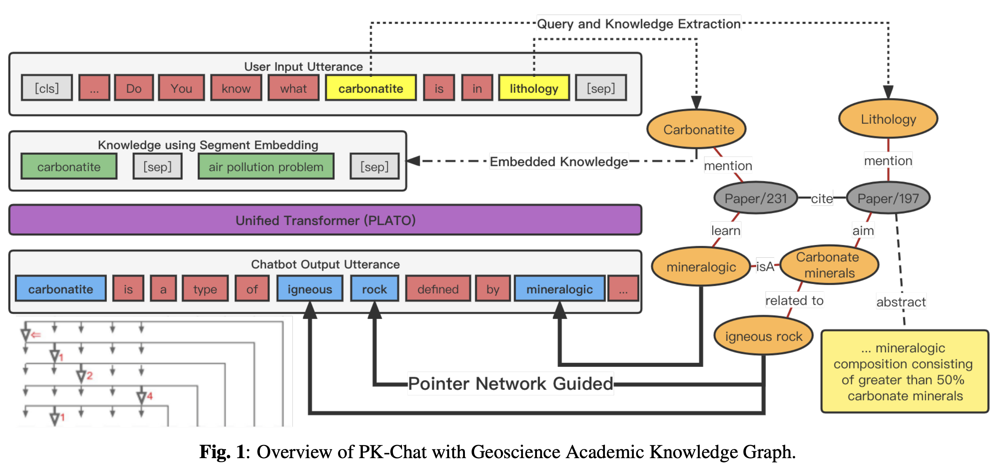

<center><h3>PK-Chat: Pointer Network Guided Knowledge Driven Generative Dialogue Model</h3>

[🪡 ArXiv](https://arxiv.org/abs/2304.00592)

</center>

This repo collects the first academic dialogue dataset with words sourced from the [GAKG](https://github.com/davendw49/gakg).

> The implimentation with *PLATO* and *Paddle* are in [Dialogue_DDE](https://github.com/iiot-tbb/Dialogue_DDE)



## Data

### Data format
Our model supports two kinds of data formats for dialogue context: `multi` and `multi_knowledge`.

* `multi`: multi-turn dialogue context.
```txt
u_1 __eou__ u_2 __eou__ ... u_n \t r
```
* `multi_knowledge`: multi-turn dialogue context with background knowledges.
```txt
k_1 __eou__ k_2 __eou__ ... k_m \t u_1 __eou__ u_2 __eou__ ... u_n \t r
```

### Usage

```bash
bash make_data.sh
```

## Citation

```
@misc{deng2023pkchat,
      title={PK-Chat: Pointer Network Guided Knowledge Driven Generative Dialogue Model}, 
      author={Cheng Deng and Bo Tong and Luoyi Fu and Jiaxin Ding and Dexing Cao and Xinbing Wang and Chenghu Zhou},
      year={2023},
      eprint={2304.00592},
      archivePrefix={arXiv},
      primaryClass={cs.CL}
}
```